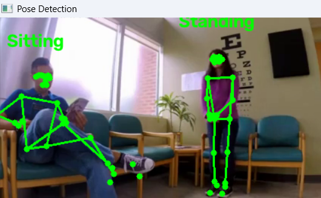
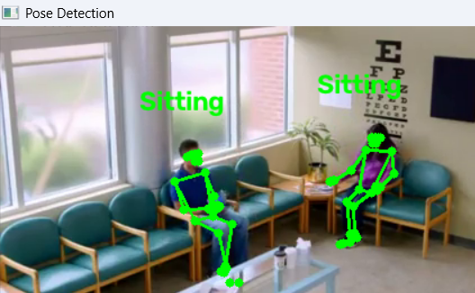
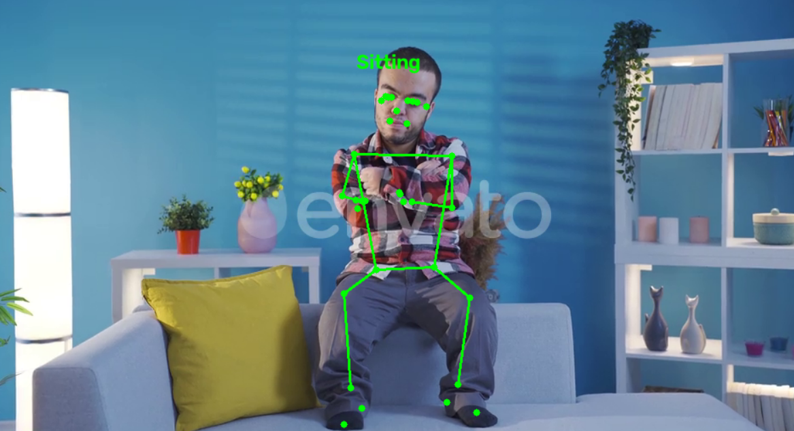
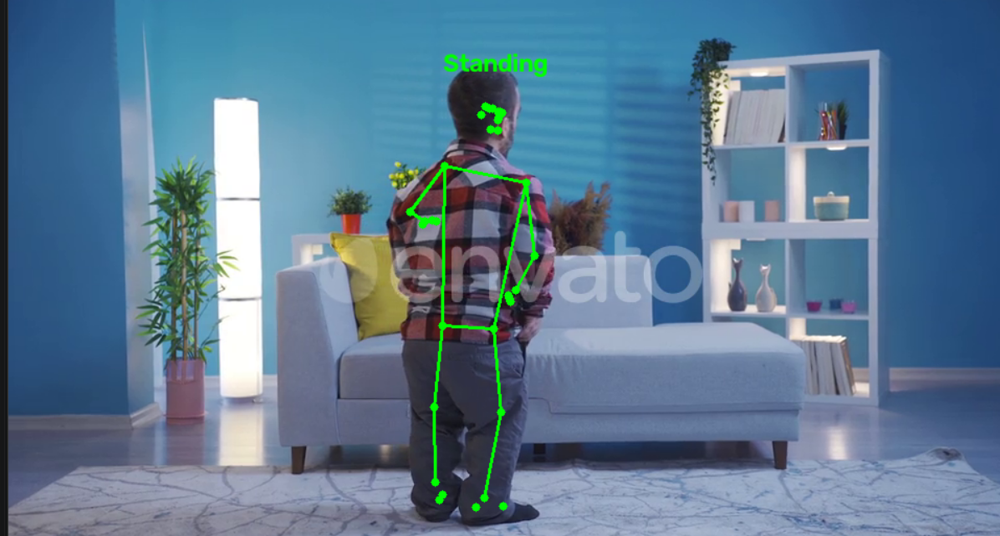
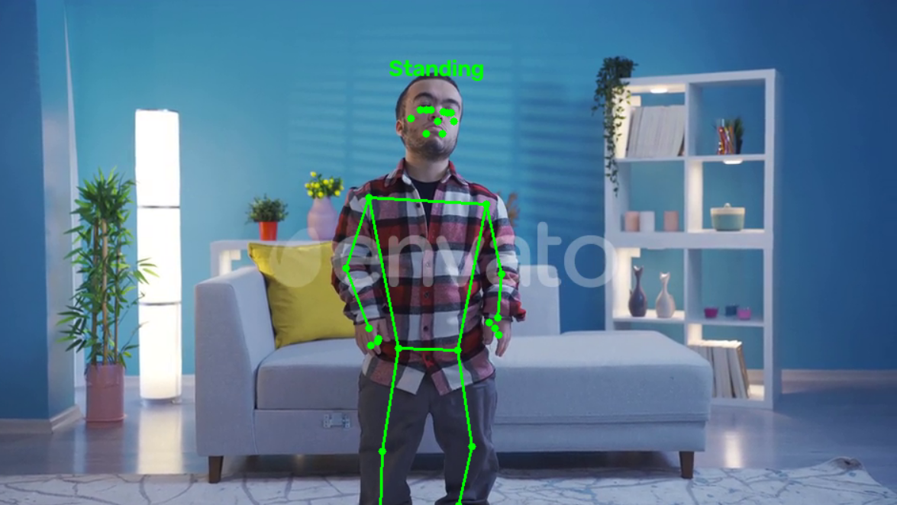

# Human Pose Detection

A real-time human pose detection project using MediaPipe Pose Landmarker and OpenCV.

## Features

- Detects multiple people in a video
- Extracts human body landmarks
- Calculates knee joint angles
- Classifies basic poses as Standing or Sitting
- Displays the detected pose on the video

## Technologies

- Python
- OpenCV
- MediaPipe
- NumPy

## Demo

<p align="center">
  
  
  
  
</p>
<p align="center">
  
  
  
</p>

## How to Run

1. Install the dependencies:

```bash
pip install -r requirements.txt
```
2. Download the MediaPipe Pose Landmarker model and place it in the project root:

```bash
pose_landmarker.task
```
3. Put the input video in:

```bash
video/sample.mp4
```
4. Run:

```bash
python main.py
```
